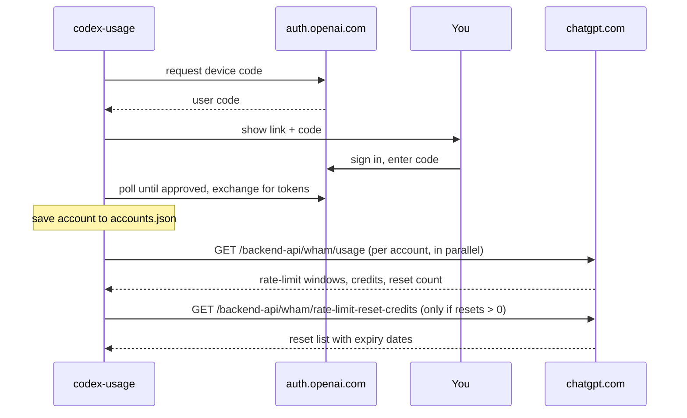

# codex-usage

[](https://github.com/AnandChowdhary/codex-usage/actions/workflows/ci.yml)
[](https://pkg.go.dev/github.com/AnandChowdhary/codex-usage)

**See how much Codex usage is left across all your ChatGPT accounts, in one command.**

If you use Codex with more than one ChatGPT account (a personal Plus plan, a
Pro plan, a Team workspace), you can't see which one still has room without
signing in to each. `codex-usage` signs in to all of them once and shows their
limits side by side.

```
$ codex-usage
ACCOUNT         PLAN  5H LEFT  RESETS  WEEKLY LEFT  RESETS       NOTES
work@acme.com   pro   -        -       81%          Mon 07:33
me@example.com  plus  0%       38m     12%          Oct 8 12:00  limit reached; 1 usage limit reset available (expires in 5h00m)
side@proton.me  plus  64%      4h02m   90%          Thu 18:10
```

- **Multiple accounts.** Add as many ChatGPT accounts and workspaces as you like.
- **Codex's own sign-in.** It uses Codex's device-code flow: open a link, type
  a code, done. This tool never sees your password, and there are no API keys.
- **Doesn't touch your Codex login.** Every account gets its own session, and
  `~/.codex/auth.json` is never read or changed.
- **Fast.** All accounts are checked in parallel, and expiring sign-ins are
  renewed automatically.
- **Scriptable.** `--json` output and meaningful exit codes.
- **One small binary with no dependencies.** It uses only Go's standard library
  and runs on macOS, Linux and Windows.

## Install

```sh
go install github.com/AnandChowdhary/codex-usage@latest
```

This needs Go 1.24 or newer. To build from source instead:

```sh
git clone https://github.com/AnandChowdhary/codex-usage
cd codex-usage
go build -o codex-usage .
```

## Quick start

**1. Sign in to an account**

```
$ codex-usage login
Sign in to a ChatGPT account with Codex access.

1. Open this link and sign in:
   https://auth.openai.com/codex/device

2. Enter this one-time code (expires in 15 minutes):
   ABCD-12345

Only continue if you started this sign-in. If a website or another person gave you this code, cancel.

Waiting for approval…

✓ Signed in as me@example.com (plus). Saved as me@example.com.
```

Open the link on any device, including your phone. Sign in to the ChatGPT
account you want to add and enter the code.

**2. Repeat for each account.** If one login has several workspaces (e.g.
personal and Team), sign in once per workspace and pick a different one each
time.

**3. Check your usage**

```sh
codex-usage
```

## Commands

| Command | What it does |
|---|---|
| `codex-usage` | Show usage for every account. Same as `codex-usage usage`. |
| `codex-usage --all` | Also show the code-review limit and per-model limits. |
| `codex-usage --json` | Print usage as JSON. |
| `codex-usage login` | Sign in to an account with a device code. |
| `codex-usage login --label work` | Give the account a short name. The default is its email. |
| `codex-usage login --open` | Also open the sign-in page in your browser. |
| `codex-usage accounts` | List signed-in accounts and whether they're still valid. Add `--json` for JSON. |
| `codex-usage logout <label\|email>` | End an account's session and remove it. |
| `codex-usage version` | Print the version. |

Every command accepts `--config PATH` to use a different accounts file.

### Reading the table

- There's a **LEFT / RESETS** column pair for each limit window your accounts
  report, shortest first. Plans differ: Pro may only have a weekly window,
  while Plus has both 5-hour and weekly windows. A `-` means that account
  doesn't have that window.
- **LEFT** is the share of the window still available. It's green above 50%,
  yellow above 20%, and red below that.
- **RESETS** is a countdown when the reset is less than a day away, and a
  local date and time otherwise.
- **NOTES** says when a limit or spend cap is reached, shows any credit
  balance, and explains any account that couldn't be checked. It also shows
  any **usage limit resets** the account has earned, and when the next one
  expires. Resets are what Codex's `/usage` menu offers under "Redeem reset".
  You can redeem one there or in ChatGPT to clear that account's current
  limits.

### JSON

```sh
codex-usage --json | jq -r '.accounts[] | "\(.label): \([.rate_limit.windows[]? | "\(.name) \(.left_percent)%"] | join(", "))"'
```

```jsonc
{
  "fetched_at": "2026-09-28T11:23:31Z",
  "accounts": [
    {
      "label": "work",
      "email": "work@acme.com",
      "plan": "pro",
      "rate_limit": {
        "allowed": true,
        "limit_reached": false,
        "windows": [
          {
            "name": "weekly",
            "used_percent": 19,
            "left_percent": 81,
            "window_seconds": 604800,
            "resets_at": "2026-10-05T07:33:56Z"
          }
        ]
      },
      "credits": { "has_credits": false, "unlimited": false, "balance": "0" },
      "rate_limit_reset_credits": {
        "available_count": 1,
        "credits": [
          {
            "id": "…",
            "title": "Full reset",
            "reset_type": "codex_rate_limits",
            "granted_at": "2026-09-21T00:00:00Z",
            "expires_at": "2026-09-28T17:00:00Z"
          }
        ]
      }
    }
  ]
}
```

### Exit codes

| Code | Meaning |
|---|---|
| `0` | Every account was checked. |
| `1` | At least one account couldn't be checked (e.g. it needs to sign in again), or the command failed. |
| `2` | Invalid command or flags. |
| `130` | Interrupted. |

## How it works

`codex-usage` uses the same sign-in and endpoints as the
[Codex CLI](https://github.com/openai/codex):



- **Refresh tokens are single-use.** A new token replaces the old one each
  time a sign-in is renewed. `codex-usage` saves the new token immediately and
  holds a file lock while renewing, so two runs at once never spend the same
  token.
- **Expired or revoked sign-ins** are marked "sign in again" and skipped until
  you run `codex-usage login` for that account. Temporary errors only show a
  warning.

[docs/SPEC.md](docs/SPEC.md) has the full protocol, including request and
response shapes.

> [!IMPORTANT]
> These are private, undocumented OpenAI endpoints. They may change or stop
> working without notice. `codex-usage` only reads usage for accounts you sign
> in to yourself.

## Storage and security

- Accounts are stored in `~/.codex-usage/accounts.json`. You can change this
  with `$CODEX_USAGE_HOME` or `--config PATH`.
- The file contains sign-in tokens, like Codex's own `auth.json`. It's created
  with mode `0600` (only you can read it) in a `0700` directory, and written
  atomically.
- `logout` removes the account and also revokes its session with OpenAI.
- OS keychain storage is planned for v2 (see [TODO.md](TODO.md)).

## Development

```sh
go test -race ./...
```

The tests run every command against a fake auth server and ChatGPT backend,
so no network access is needed. To point a real build at other servers, use:

| Variable | Default |
|---|---|
| `CODEX_USAGE_AUTH_BASE_URL` | `https://auth.openai.com` |
| `CODEX_USAGE_CHATGPT_BASE_URL` | `https://chatgpt.com/backend-api` |

```
main.go              entry point
internal/cli/        commands, table and JSON output
internal/auth/       device-code login, token refresh and revocation, JWT claims
internal/store/      accounts.json with atomic writes and cross-process locking
internal/usage/      /wham/usage and reset-credit client, response types
```

## Roadmap

See [TODO.md](TODO.md).

---

Not affiliated with OpenAI. Codex and ChatGPT are trademarks of OpenAI.
