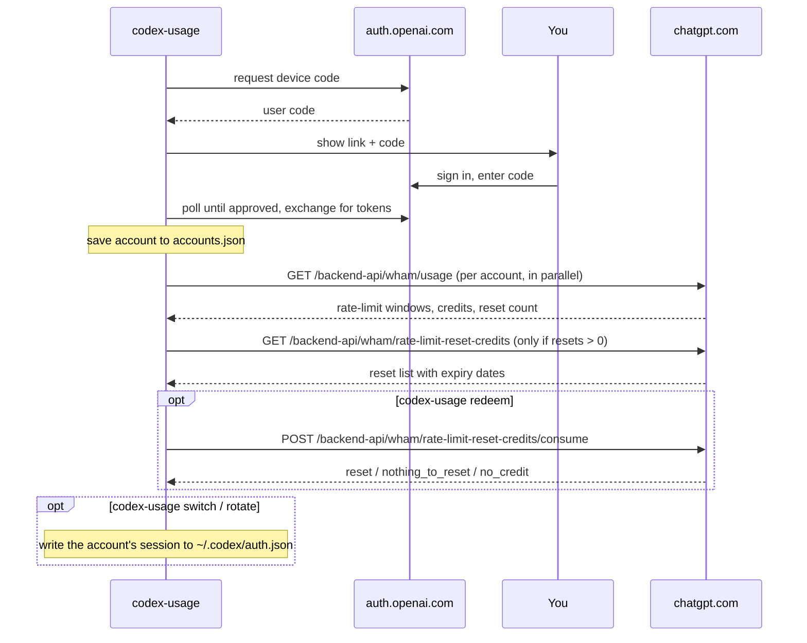

# codex-usage

[](https://github.com/AnandChowdhary/codex-usage/actions/workflows/ci.yml)
[](https://pkg.go.dev/github.com/AnandChowdhary/codex-usage)
[](LICENSE)

**See how much Codex and Claude Code usage is left across all your accounts, in one command.**

If you use Codex with more than one ChatGPT account (a personal Plus plan, a
Pro plan, a Team workspace), or Claude Code with more than one Claude plan,
you can't see which one still has room without signing in to each.
`codex-usage` signs in to all of them once, shows their limits side by side,
and switches Codex or Claude Code to whichever has the most left.

```
$ codex-usage
ACCOUNT         PLAN  5H LEFT  RESETS  WEEKLY LEFT  RESETS       NOTES
work@acme.com   pro   -        -       81%          Mon 07:33
me@example.com  plus  0%       38m     12%          Oct 8 12:00  limit reached; 1 usage limit reset available (expires in 5h00m)
side@proton.me  plus  64%      4h02m   90%          Thu 18:10
```

- **Multiple accounts.** Add as many ChatGPT accounts and workspaces as you like.
- **Codex's own sign-in.** It uses Codex's device-code flow: open a link, type
  a code, done. This tool never sees your password, and there are no API keys.
- **Switch Codex between accounts.** `switch` signs the Codex CLI in to any of
  your accounts, and `rotate` picks the one with the most usage left. Codex's
  login is only changed when you run one of these commands.
- **Claude Code too.** Add Claude Pro and Max accounts as
  [Claude Code profiles](#claude-code). Their usage appears next to your Codex
  accounts, and `claude switch`/`claude rotate` pick the profile new terminals
  use.
- **Usage limit resets.** It shows which accounts have earned resets and when
  they expire. `codex-usage redeem` uses one without opening Codex.
- **Fast.** All accounts are checked in parallel, and expiring sign-ins are
  renewed automatically.
- **Scriptable.** `--json` output and meaningful exit codes.
- **One small binary with no dependencies.** It uses only Go's standard library
  and runs on macOS, Linux and Windows.

## Install

Download a ready-to-use binary from the
[latest release](https://github.com/AnandChowdhary/codex-usage/releases/latest),
or from a terminal:

```sh
# macOS on Apple silicon; swap the archive name for other platforms
curl -fsSL https://github.com/AnandChowdhary/codex-usage/releases/latest/download/codex-usage_darwin_arm64.tar.gz | tar -xz codex-usage
sudo mv codex-usage /usr/local/bin/
```

| Platform | Archive |
|---|---|
| macOS, Apple silicon | `codex-usage_darwin_arm64.tar.gz` |
| macOS, Intel | `codex-usage_darwin_amd64.tar.gz` |
| Linux, x86-64 | `codex-usage_linux_amd64.tar.gz` |
| Linux, ARM64 | `codex-usage_linux_arm64.tar.gz` |
| Windows, x86-64 | `codex-usage_windows_amd64.zip` |
| Windows, ARM64 | `codex-usage_windows_arm64.zip` |

The binaries aren't signed. If macOS blocks one downloaded with a browser, run
`xattr -d com.apple.quarantine codex-usage`. Downloads with `curl` aren't
affected.

With Go 1.24 or newer:

```sh
go install github.com/AnandChowdhary/codex-usage@latest
```

## Quick start

**1. Sign in to an account**

```
$ codex-usage login
Sign in to a ChatGPT account with Codex access.

1. Open this link and sign in:
   https://auth.openai.com/codex/device

2. Enter this one-time code (expires in 15 minutes):
   ABCD-12345

Only continue if you started this sign-in. If a website or another person gave you this code, cancel.

Waiting for approval…

✓ Signed in as me@example.com (plus). Saved as me@example.com.
```

Open the link on any device, including your phone. Sign in to the ChatGPT
account you want to add and enter the code.

**2. Repeat for each account.** If one login has several workspaces (e.g.
personal and Team), sign in once per workspace and pick a different one each
time.

**3. Check your usage**

```sh
codex-usage
```

## Commands

| Command | What it does |
|---|---|
| `codex-usage` | Show usage for every account. Same as `codex-usage usage`. |
| `codex-usage --all` | Also show the code-review limit and per-model limits. |
| `codex-usage --json` | Print usage as JSON. |
| `codex-usage login` | Sign in to an account with a device code. |
| `codex-usage login --label work` | Give the account a short name. The default is its email. |
| `codex-usage login --open` | Also open the sign-in page in your browser. |
| `codex-usage accounts` | List signed-in accounts and whether they're still valid. Add `--json` for JSON. |
| `codex-usage redeem <label\|email>` | Use one of the account's usage limit resets, after confirming. See [Usage limit resets](#usage-limit-resets). |
| `codex-usage switch <label\|email>` | Sign the Codex CLI in to this account. Without an account, it shows which one Codex uses. See [Switching Codex between accounts](#switching-codex-between-accounts). |
| `codex-usage rotate` | Switch Codex to the account with the most usage left. `--dry-run` only shows the choice. |
| `codex-usage logout <label\|email>` | End an account's session and remove it. |
| `codex-usage claude login <profile>` | Sign in a [Claude Code profile](#claude-code) with Claude Code's own sign-in. |
| `codex-usage claude switch <profile>` | Use that profile in new terminals (and this one, with `eval`). |
| `codex-usage claude rotate` | Switch to the Claude Code profile with the most usage left. |
| `codex-usage claude run <profile> [args]` | Start Claude Code in a profile. |
| `codex-usage claude logout <profile>` | Sign a profile out and delete it. |
| `codex-usage version` | Print the version. |

Every command accepts `--config PATH` to use a different accounts file.

### Reading the table

- There's a **LEFT / RESETS** column pair for each limit window your accounts
  report, shortest first. Plans differ: Pro may only have a weekly window,
  while Plus has both 5-hour and weekly windows. A `-` means that account
  doesn't have that window.
- **LEFT** is the share of the window still available. It's green above 50%,
  yellow above 20%, and red below that.
- **RESETS** is a countdown when the reset is less than a day away, and a
  local date and time otherwise.
- **NOTES** says when a limit or spend cap is reached, shows any credit
  balance, and explains any account that couldn't be checked. It also shows
  any [usage limit resets](#usage-limit-resets) the account has earned, and
  when the next one expires.

### Usage limit resets

Some accounts earn **usage limit resets**. Using one clears the account's
current usage limits straight away. It's the same as "Redeem reset" in Codex's
`/usage` menu. `codex-usage` shows available resets in NOTES, and `redeem`
uses one:

```
$ codex-usage redeem work
work@acme.com (plus)
  5h        0% left, resets in 2h13m
  weekly   40% left, resets Thu 09:00
  2 usage limit resets available (first expires in 21h00m)

Use a usage limit reset on work? This clears its current usage limits and can't be undone. [y/N] y
✓ Usage limits reset for work (2 windows).
  5h      100% left, resets in 2h13m
  weekly  100% left, resets Thu 09:00
```

- By default it uses the reset that expires first. To pick a different one,
  pass `--credit ID`; the IDs are in `codex-usage --json`.
- It always asks first. `--yes` skips the question, e.g. in scripts.
- A reset can't be undone. Each attempt sends a unique request ID, and retries
  after network errors reuse it, so one command never spends two resets.
- If the account's usage doesn't need a reset, ChatGPT says so and the
  command exits with status 1.

### Switching Codex between accounts

`switch` signs the Codex CLI in to one of your accounts. When one account runs
out, `rotate` moves Codex to whichever account has the most usage left:

```
$ codex-usage rotate
✓ Switched Codex from work to side (side@example.com, plus): 60% left in the 5h window.
Running Codex sessions (CLI, IDE extension, app) keep using the previous account until you restart them.

$ codex-usage switch work
✓ Switched Codex from side to work (work@acme.com, pro).
```

- **Restart Codex after switching.** Running sessions keep using the previous
  account until they're restarted.
- The usage table marks the account Codex is using with `(codex)`.
  `codex-usage switch` without an account prints it.
- `rotate` scores each account by the share left in its tightest window. For
  example, 90% of the 5h window but 30% of the week counts as 30%. Accounts
  that have hit a limit are skipped. If no account has usage left, it tells
  you which accounts have a [usage limit reset](#usage-limit-resets).
- **Nothing is lost.** If Codex is signed in to an account that codex-usage
  doesn't have, it's saved before being replaced, so you can switch back to
  it.
- **Codex and codex-usage share one session per account.** Whenever either
  side renews it, codex-usage copies the newer tokens to the other side. This
  way neither side is left holding a refresh token that's already been spent.
  Running `codex-usage logout` on the account Codex is using doesn't end
  Codex's session.
- **It needs Codex's default file storage.** It doesn't work with
  `cli_auth_credentials_store = "keyring"` or `"auto"`.
- **API-key sign-ins are protected.** If Codex is signed in with an API key,
  `switch` refuses to replace it. With `--force` it replaces it and keeps a
  backup at `~/.codex-usage/codex-auth.backup.json`.

### Claude Code

Each Claude account is a **profile**: its own Claude Code configuration folder
(`CLAUDE_CONFIG_DIR`) under `~/.codex-usage/claude/`. Your normal Claude Code
sign-in shows up as the `default` profile.

```
$ codex-usage claude login work
Opening browser to sign in…
Paste code here if prompted > …
✓ Signed in Claude Code profile work (you@acme.com, max).

$ codex-usage
Claude Code
ACCOUNT          PLAN  5H LEFT  RESETS  WEEKLY LEFT  RESETS     NOTES
default          max   100%     -       0%           Wed 09:00  limit reached
work (current)   max   94%      2h33m   72%          Tue 21:59

$ eval "$(codex-usage claude rotate)"
✓ Switched Claude Code from default to work (you@acme.com, max): 72% left in the weekly window.
```

- **codex-usage never touches Claude credentials.**
  [Anthropic's terms](https://code.claude.com/docs/en/legal-and-compliance#authentication-and-credential-use)
  don't allow other apps to handle Claude sign-in or store Claude tokens, so
  everything goes through the unmodified `claude` binary:
  - `claude login` runs `claude auth login` with the profile's
    `CLAUDE_CONFIG_DIR`, and Claude Code keeps its own credentials.
  - Usage comes from running Claude Code's `/usage` command headlessly. It's
    answered locally, so **checking usage costs no tokens** and doesn't start
    a 5-hour window.
- **Switching works per terminal.** `claude switch <profile>` and
  `claude rotate` record the profile for new terminals, and print the command
  that switches the current one. To use them:
  - Run them with `eval "$(…)"` to switch the terminal you're in too.
  - Add the line they suggest to your shell's startup file (e.g. `~/.zshrc`)
    once, so every new terminal follows along.
  - `claude run <profile>` starts Claude Code in a profile directly.
- **It doesn't affect other apps.** The switch applies to Claude Code started
  from a terminal. The IDE extensions and the desktop app keep their own
  sign-in.
- **Windows:** `switch` prints POSIX shell or fish commands, so on Windows use
  `codex-usage claude run <profile>`.
- **Per-model limits** (e.g. a weekly Fable limit) appear with `--all`.
  `rotate` ignores them: it picks the profile with the most left in its
  tightest 5-hour or weekly window.
- **Some Codex features aren't available.** Usage limit resets and credits
  aren't reported, because `/usage` doesn't show them.
- **Turning it off:** `CODEX_USAGE_CLAUDE_BIN=off` disables Claude Code
  support. You can also set it to a path to use a different `claude` binary.

### JSON

```sh
codex-usage --json | jq -r '.accounts[] | "\(.label): \([.rate_limit.windows[]? | "\(.name) \(.left_percent)%"] | join(", "))"'
```

Claude Code profiles appear in a separate `claude` array, with the same
fields plus `config_dir` and `current`.

```jsonc
{
  "fetched_at": "2026-09-28T11:23:31Z",
  "accounts": [
    {
      "label": "work",
      "email": "work@acme.com",
      "plan": "pro",
      "in_codex": true,
      "rate_limit": {
        "allowed": true,
        "limit_reached": false,
        "windows": [
          {
            "name": "weekly",
            "used_percent": 19,
            "left_percent": 81,
            "window_seconds": 604800,
            "resets_at": "2026-10-05T07:33:56Z"
          }
        ]
      },
      "credits": { "has_credits": false, "unlimited": false, "balance": "0" },
      "rate_limit_reset_credits": {
        "available_count": 1,
        "credits": [
          {
            "id": "…",
            "title": "Full reset",
            "reset_type": "codex_rate_limits",
            "granted_at": "2026-09-21T00:00:00Z",
            "expires_at": "2026-09-28T17:00:00Z"
          }
        ]
      }
    }
  ]
}
```

### Exit codes

| Code | Meaning |
|---|---|
| `0` | Every account was checked. |
| `1` | At least one account couldn't be checked (e.g. it needs to sign in again), a reset couldn't be redeemed, or the command failed. |
| `2` | Invalid command or flags. |
| `130` | Interrupted. |

## How it works

`codex-usage` uses the same sign-in and endpoints as the
[Codex CLI](https://github.com/openai/codex):



- **Refresh tokens are single-use.** A new token replaces the old one each
  time a sign-in is renewed. `codex-usage` saves the new token immediately and
  holds a file lock while renewing, so two runs at once never spend the same
  token.
- **Expired or revoked sign-ins** are marked "sign in again" and skipped until
  you run `codex-usage login` for that account. Temporary errors only show a
  warning.

[docs/SPEC.md](docs/SPEC.md) has the full protocol, including request and
response shapes.

> [!IMPORTANT]
> These are private, undocumented OpenAI endpoints. They may change or stop
> working without notice. `codex-usage` only acts on accounts you sign in to
> yourself.

## Storage and security

- Accounts are stored in `~/.codex-usage/accounts.json`. You can change this
  with `$CODEX_USAGE_HOME` or `--config PATH`.
- The file contains sign-in tokens, like Codex's own `auth.json`. It's created
  with mode `0600` (only you can read it) in a `0700` directory, and written
  atomically.
- `logout` removes the account and also revokes its session with OpenAI. The
  exception is the account Codex is using: its session is left alone.
- `switch` and `rotate` write `~/.codex/auth.json` (or `$CODEX_HOME/auth.json`)
  the same way `codex login` does, with mode `0600`.
- OS keychain storage is planned for v2 (see [TODO.md](TODO.md)).

## Development

```sh
go test -race ./...
```

### Releases

Every push to `main` that passes CI is released automatically
([release.yml](.github/workflows/release.yml)). The version comes from the
[conventional commit](https://www.conventionalcommits.org) prefixes since the
last release:

| Commits | Release |
|---|---|
| `feat: …` | minor, `0.1.0` → `0.2.0` |
| `fix: …`, `perf: …`, `refactor: …` or no prefix | patch, `0.1.0` → `0.1.1` |
| `feat!: …` or a `BREAKING CHANGE:` footer | major (minor before 1.0) |
| only `docs:`, `test:`, `ci:`, `chore:`, `style:`, `build:` | no release |

[GoReleaser](https://goreleaser.com) then builds the binaries and publishes
the GitHub release, with a changelog grouped into features and fixes. To
release on demand, or to force a particular bump, run the Release workflow
from the Actions tab.

The tests run every command against a fake auth server and ChatGPT backend,
so no network access is needed. To point a real build at other servers, use:

| Variable | Default |
|---|---|
| `CODEX_USAGE_AUTH_BASE_URL` | `https://auth.openai.com` |
| `CODEX_USAGE_CHATGPT_BASE_URL` | `https://chatgpt.com/backend-api` |

```
main.go              entry point
internal/cli/        commands, table and JSON output
internal/auth/       device-code login, token refresh and revocation, JWT claims
internal/store/      accounts.json with atomic writes and cross-process locking
internal/codexauth/  the Codex CLI's auth.json, for switch and rotate
internal/claude/     Claude Code profiles, run through the claude binary
internal/usage/      /wham/usage and usage limit reset client, response types
```

## Roadmap

See [TODO.md](TODO.md).

## License

[MIT](LICENSE) © Anand Chowdhary

---

Not affiliated with OpenAI. Codex and ChatGPT are trademarks of OpenAI.
